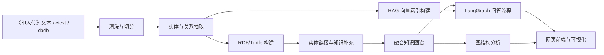
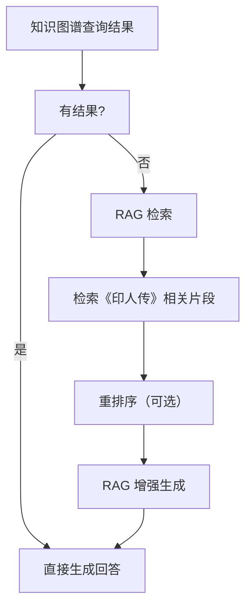

```markdown
# 基于《印人传》的历史人物知识问答系统：正式技术文档版

## 1. 项目概述
- 本项目面向《印人传》构建一个可本地运行的历史人物知识问答系统，覆盖知识抽取、知识图谱构建、实体链接、知识补充、问答推理与前端展示。
- 系统实现不额外依赖独立部署的软件平台，统一采用 Python、JavaScript 及其生态中的库与包完成全部功能，例如抽取、RDF 处理、图分析、问答编排、前端界面与可视化。
- 项目目标是将古籍中的非结构化知识转化为可查询、可推理、可展示的结构化知识服务。

## 2. 需求与范围
- 任务范围对应评分细则，包含知识抽取、命名实体识别、人物关系抽取、图结构分析、本体构建、实体链接与知识补充、RAG 检索增强、问答系统、网页前端与**人物关系网络可视化**。
- 输入数据包括《印人传》文本、ctext 人物条目、cbdb 人物条目及可选辅助词表。
- 输出数据包括 RDF/Turtle 文件、融合后的知识图谱文件、FAISS 向量索引、SPARQL 查询接口、问答结果与网页展示界面（含关系网络可视化）。
- 非功能需求包括：准确性、可解释性、可追溯性、本地可运行、便于课程演示、便于后续扩展。

## 3. 总体架构
- 系统采用"文本层—抽取层—图谱层—推理层—展示层"的分层设计。
- 文本层负责《印人传》及外部数据库数据接入；抽取层完成实体与关系抽取；图谱层完成 RDF 存储与实体融合；推理层完成工具调用、SPARQL 生成、RAG 检索与回答生成；展示层提供网页界面、关系网络可视化与图分析结果。
- 全流程以库和包实现，避免额外引入独立图数据库、独立检索平台或专用中间件。



## 4. 知识抽取模块

### 4.1 总体抽取方案

采用"古文预处理 → 规则正则优先 → 大模型兜底"的混合方案，分三阶段执行。方案参考了 Shiji-KB（《史记》知识库）的标注体系与 SikuRoBERTa 古籍专用预训练模型的经验，针对古文无标点、词汇与现代汉语差异大的特点，专门引入预处理层。

**阶段零：古文预处理（参考 Shiji-KB / SikuRoBERTa）**

- **繁简与标点处理**：《印人传》原文为无标点繁体文本，需先进行标点还原（SikuRoBERTa 辅助断句）再用于后续抽取。SikuRoBERTa 在《四库全书》5.36亿字语料上预训练，相比通用模型在断句 F1 上提升显著。
- **繁简转换**：统一转为繁体（与 CBDB/ctext 保持一致），再辅以异体字映射表。
- **文本切分**：按"人物条目"切分为独立处理单元，每条目保留章节编号和原文句段，作为后续抽取的最小粒度。
- **标注格式**：参考 Shiji-KB 的 〖TYPE X〗 标注格式，为每个识别出的实体附加类型标签和原文跨度信息。

**阶段一：规则与词典抽取（高精确率）**

- 构建古汉语人名词典（含字、号、别名），基于正则精确匹配人物名称。
- 构建朝代/时期词表（嘉靖、万历、明末、清初等），基于正则匹配时间。
- 构建地名词典（苏州、吴门、杭州、西泠等），基于正则匹配地名。
- 构建书体/印风/流派词典（吴门印派、浙派、秦汉印风、文何风格等），基于正则匹配风格标签。
- 对"字xxx、号xxx、xxx之长子/次子/之父、开xxx之先、继承xxx"等高频句式编写正则模板，直接触发关系抽取。

**阶段二：大模型抽取（高召回率）**

- 对规则无法覆盖的段落，调用本地大模型（Qwen/Qwen2.5-Instruct，通过 Ollama 本地部署）进行关系抽取。
- 使用 JSON Schema 指定输出格式，引导模型输出结构化的三元组。
- 每次调用限制上下文在 512 token 以内，将原段落 + 抽取提示发送至模型，模型以 JSON Schema 输出三元组。
- 若本地无 GPU 或模型推理过慢，降级为规则抽取，跳过大模型阶段。

**抽取工具链**：Python + regex + pydantic（结构化输出验证） + Ollama（本地模型调用） + SikuRoBERTa（断句 + NER 增强）。

> **模型选用说明**：AI太炎模型权重未开源、不支持本地部署，不采用；Xunzi 系列需额外加载7B+基座模型、部署复杂，不作为主力方案，仅记录于附录作为备选参考。

### 4.2 命名实体抽取

**抽取类型与示例**：

| 实体类型 | 示例 | 技术方法 |
|---|---|---|
| 人物（印人） | 文彭、文徵明、祝允明、丁敬 | 正则词典匹配 + SikuRoBERTa NER 增强 |
| 地名 | 苏州、吴门、杭州、西泠 | 正则词典匹配 |
| 时间 | 嘉靖、万历、明末、清初 | 正则词表匹配 |
| 书体/印风 | 吴门印派、浙派、秦汉印风 | 正则词典匹配 |
| 字号 | 寿承（字）、三桥（号）、秋堂（号） | 正则模板匹配 |
| 官职/身份 | 秀才、知州、隐士 | 正则词典 + SikuRoBERTa NER 补充 |

**技术实现（参考 CHisIEC / Shiji-KB 标注体系）**：
1. **预处理**：SikuRoBERTa 辅助断句标点，繁体化，异体字规范化。
2. **第一轮**：词典正则扫描，标记所有候选实体 mention 及其类型，记录原文跨度（start, end）。
3. **第二轮**：SikuRoBERTa 微调模型对遗漏段落进行补抽（NER），尤其针对官职、不常见地名。
4. **第三轮**：大模型对复杂描述句进行全局关系推理，补充跨句关系。
5. **第四轮**：合并去重，输出标准化的实体列表（含原文跨度、类型、置信度、来源章节）。

**质量保证**：规则方法标注置信度 0.95；SikuRoBERTa NER 方法标注置信度 0.88；模型方法标注置信度 0.80；多方法冲突时以规则为准、人工复核。

### 4.3 人物关系抽取

**关系分类体系**：

| 一级类别 | 二级类型 | 谓词命名 | 示例 |
|---|---|---|---|
| 亲属关系 | 父子 | `:fatherOf` / `:sonOf` | 文徵明 → 文彭 |
| 亲属关系 | 兄弟 | `:brotherOf` | — |
| 师承关系 | 师徒 | `:teacherOf` / `:studentOf` | 何震 → 苏宣 |
| 交游关系 | 交往 | `:friendOf` / `:associatedWith` | 文彭 ↔ 祝允明 |
| 流派关系 | 开创 | `:foundedSchool` | 文彭 → 吴门印派 |
| 流派关系 | 归属 | `:belongsToSchool` | 丁敬 → 浙派 |
| 流派关系 | 继承 | `:inheritedFrom` | 何震 ← 文彭 |
| 属性关系 | 字/号 | `:styleName` / `:hao` | 寿承 → 文彭 |
| 属性关系 | 籍贯 | `:fromPlace` | 苏州 → 文彭 |
| 属性关系 | 生卒年 | `:birthYear` / `:deathYear` | 1498-1575 → 文彭 |

**模板触发规则（部分）**：

```
# 字/号模板
(?P<person>[\u4e00-\u9fa5]{2,4}),?字(?P<style>[\u4e00-\u9fa5]{1,4})
(?P<person>[\u4e00-\u9fa5]{2,4}),?号(?P<hao>[\u4e00-\u9fa5]{1,4})

# 亲属模板
(?P<parent>[\u4e00-\u9fa5]{2,4})(?P<child>长|次|季)?子
(?P<person>[\u4e00-\u9fa5]{2,4})为(?P<father>[\u4e00-\u9fa5]{2,4})(?P<rel>长|次)子

# 开创/流派模板
开(?P<school>[\u4e00-\u9fa5]{2,4})之先
(?P<person>[\u4e00-\u9fa5]{2,4}),?创(?P<school>[\u4e00-\u9fa5]{2,4})
(?P<person>[\u4e00-\u9fa5]{2,4})为(?P<school>[\u4e00-\u9fa5]{2,4})之祖
```

**模型辅助抽取**：对于无模板匹配的复杂描述句，由大模型按以下 JSON Schema 输出：

```json
{
  "relations": [
    {
      "subject": "人名",
      "predicate": "关系类型",
      "object": "对方人名/属性值",
      "confidence": 0.85,
      "evidence": "原文片段"
    }
  ]
}
```

### 4.4 抽取输出规范

每条事实写入一个 RDF 三元组，附带以下元数据节点：

```turtle
ex:WenPeng rel:father ex:WenZhengming .
ex:WenPeng_evidence a ex:ExtractionEvidence ;
    ex:source "《印人传》第一章" ;
    ex:text "文彭，字寿承，号三桥，文徵明长子，开吴门印派之先" ;
    ex:confidence "0.95" ;
    ex:method "rule-template" ;
    ex:extractedBy ex:WenPeng .
```

## 5. 本体与 RDF 设计

### 5.1 本体类层次

```turtle
@prefix rdfs: <http://www.w3.org/2000/01/rdf-schema#> .
@prefix owl: <http://www.w3.org/2002/07/owl#> .

:Thing a owl:Class .
:Person a owl:Class ; rdfs:subClassOf :Thing .
:Place a owl:Class ; rdfs:subClassOf :Thing .
:TimePeriod a owl:Class ; rdfs:subClassOf :Thing .
:School a owl:Class ; rdfs:subClassOf :Thing .
:Style a owl:Class ; rdfs:subClassOf :Thing .
:Work a owl:Class ; rdfs:subClassOf :Thing .
:Artifact a owl:Class ; rdfs:subClassOf :Thing .
:Evidence a owl:Class ; rdfs:subClassOf :Thing .
:Relation a owl:Class .
```

### 5.2 核心属性设计

**人物属性**：

```turtle
:personName a owl:DatatypeProperty ; rdfs:domain :Person ; rdfs:range xsd:string .
:styleName a owl:DatatypeProperty ; rdfs:domain :Person ; rdfs:range xsd:string .
:hao a owl:DatatypeProperty ; rdfs:domain :Person ; rdfs:range xsd:string .
:birthYear a owl:DatatypeProperty ; rdfs:domain :Person ; rdfs:range xsd:integer .
:deathYear a owl:DatatypeProperty ; rdfs:domain :Person ; rdfs:range xsd:integer .
:birthYearString a owl:DatatypeProperty ; rdfs:domain :Person ; rdfs:range xsd:string .
:deathYearString a owl:DatatypeProperty ; rdfs:domain :Person ; rdfs:range xsd:string .
:nativePlace a owl:DatatypeProperty ; rdfs:domain :Person ; rdfs:range xsd:string .
:dynasty a owl:DatatypeProperty ; rdfs:domain :Person ; rdfs:range xsd:string .
:occupation a owl:DatatypeProperty ; rdfs:domain :Person ; rdfs:range xsd:string .
:officialRank a owl:DatatypeProperty ; rdfs:domain :Person ; rdfs:range xsd:string .
:confidence a owl:DatatypeProperty ; rdfs:range xsd:float .
:sourceText a owl:DatatypeProperty ; rdfs:domain :Evidence ; rdfs:range xsd:string .
:extractionMethod a owl:DatatypeProperty ; rdfs:domain :Evidence ; rdfs:range xsd:string .
```

**关系属性**：

```turtle
:fatherOf a owl:ObjectProperty ; rdfs:domain :Person ; rdfs:range :Person .
:sonOf a owl:ObjectProperty ; rdfs:inverseOf :fatherOf .
:teacherOf a owl:ObjectProperty ; rdfs:domain :Person ; rdfs:range :Person .
:studentOf a owl:ObjectProperty ; rdfs:inverseOf :teacherOf .
:friendOf a owl:ObjectProperty ; rdfs:domain :Person ; rdfs:range :Person .
:brotherOf a owl:ObjectProperty ; rdfs:domain :Person ; rdfs:range :Person .
:foundedSchool a owl:ObjectProperty ; rdfs:domain :Person ; rdfs:range :School .
:belongsToSchool a owl:ObjectProperty ; rdfs:domain :Person ; rdfs:range :School .
:inheritedFrom a owl:ObjectProperty ; rdfs:domain :Person ; rdfs:range :Person .
:influencedBy a owl:ObjectProperty ; rdfs:domain :Person ; rdfs:range :Person .
:hasStyleName a owl:DatatypeProperty ; rdfs:domain :Person ; rdfs:range xsd:string .
:hasHao a owl:DatatypeProperty ; rdfs:domain :Person ; rdfs:range xsd:string .
:fromPlace a owl:DatatypeProperty ; rdfs:domain :Person ; rdfs:range :Place .
:hasPeriod a owl:DatatypeProperty ; rdfs:domain :Person ; rdfs:range :TimePeriod .
:sameAs a owl:ObjectProperty ; rdfs:domain :Person ; rdfs:range owl:Thing .
:ctextId a owl:DatatypeProperty ; rdfs:range xsd:string .
:cbdbId a owl:DatatypeProperty ; rdfs:range xsd:string .
```

### 5.3 完整性约束（部分）

```turtle
# 一个人只能有一个生年
owl:hasValue [ a owl:Restriction ; owl:onProperty :birthYear ; owl:cardinality "1"^^xsd:integer ] .
# 父子关系须满足互逆
owl:equivalentProperty [ :fatherOf , owl:inverseOf :sonOf ] .
```

### 5.4 示例 Turtle

```turtle
@prefix ex: <http://example.org/inkperson/> .
@prefix foaf: <http://xmlns.com/foaf/0.1/> .
@prefix rel: <http://example.org/inkperson/relation/> .
@prefix xsd: <http://www.w3.org/2001/XMLSchema#> .

ex:WenPeng a ex:Person ;
    ex:personName "文彭" ;
    ex:styleName "寿承" ;
    ex:hao "三桥" ;
    ex:birthYear 1498 ;
    ex:deathYear 1575 ;
    ex:nativePlace "苏州" ;
    ex:dynasty "明" ;
    ex:confidence "0.95" ;
    ex:sameAs ex:ctext:WenPeng ;
    ex:sameAs ex:cbdb:WenPeng .
ex:WenPeng-fatherRel a ex:Evidence ;
    ex:sourceText "《印人传》文彭条" ;
    ex:text "文彭，字寿承，号三桥，文徵明长子，开吴门印派之先" ;
    ex:confidence "0.95" ;
    ex:extractionMethod "rule-template" .

ex:WenZhengming a ex:Person ;
    ex:personName "文徵明" ;
    ex:styleName "徵仲" ;
    ex:hao "衡山" ;
    ex:birthYear 1470 ;
    ex:deathYear 1559 ;
    ex:nativePlace "苏州" ;
    ex:dynasty "明" .

ex:WuMenYinPai a ex:School ;
    ex:schoolName "吴门印派" ;
    ex:period "明中期" ;
    ex:region "苏州" .

# 关系
ex:WenPeng rel:father ex:WenZhengming .
ex:WenPeng rel:foundedSchool ex:WuMenYinPai .
ex:WenPeng rel:fromPlace ex:Suzhou .
```

## 6. 实体链接与知识补充

### 6.1 ctext 与 cbdb 数据获取

**ctext**（中国哲学书电子化计划）：
- 访问方式：通过 HTTP 请求查询 ctext 人物 API（如 `https://ctext.org/searchbooks.py?cid=...`）。
- 备选方案：若 API 不稳定，直接下载 ctext的人物数据库 dump 文件（XML/JSON），本地建立检索索引。
- 人物数据包含：姓名、字、号、籍贯、朝代、生卒年、描述文本。

**cbdb**（中国历代人物传记资料库）：
- 访问方式：通过 CBDB API（`https://cbdb.fas.harvard.edu/cbdbapi/`）查询人物数据。
- 需要申请 API Key（免费），或使用公开的 CBDB SQLite 下载版。
- 人物数据包含：人物ID、姓名、字、号、生卒年、籍贯、亲属关系、社会关系、官职。

**本地索引**：将 ctext 和 cbdb 数据分别导入本地 SQLite 数据库，建立倒排索引，支持按姓名/字号/别名/朝代/籍贯等多字段检索。

### 6.2 候选召回

- **精确匹配**：姓名完全一致即召回，置信度最高。
- **别名匹配**：字号、号、别名与目标人物任一别名一致则召回。
- **模糊匹配**：通过编辑距离（Levenshtein ≤ 2）匹配姓名/字号。
- 召回结果不超过 Top-10 候选。

### 6.3 消歧规则（按优先级）

| 优先级 | 规则 | 实现 |
|---|---|---|
| 1 | 字号/号精确匹配 | 字符串相等判断 |
| 2 | 时间一致性：生卒年/活跃期交叉验证 | 数值区间比较 |
| 3 | 关系一致性：父子/师承关系须一致 | 图谱关系比对 |
| 4 | 地域一致性：籍贯须相同或相邻 | 字符串或层级地点比较 |
| 5 | 朝代一致性：须属同一朝代 | 字符串匹配 |
| 6 | 综合打分 | 加权求和（别名4分 + 时间2分 + 关系2分 + 地域1分 + 朝代1分） |

### 6.4 知识回填

- 对齐成功后，将 ctext/cbdb 中的数据以 `:sameAs` 关系关联，并复制关键属性（如生卒年、籍贯、官职）。
- 所有回填数据标注来源（`ex:dataSource "ctext"` 或 `ex:dataSource "cbdb"`）。
- 冲突时：原文数据优先，外部数据以候选属性记录。

## 7. 图结构分析

### 7.1 分析工具

使用 Python 的以下库实现，无需独立图数据库：

- **NetworkX**：图构建与基础分析（度中心性、介数中心性、接近中心性、PageRank）。
- **python-louvain**（community 库）：社区发现（Louvain 算法）。
- **matplotlib / seaborn**：分析结果可视化。

### 7.2 分析指标与实现

| 分析项 | 指标 | 实现 |
|---|---|---|
| 度中心性 | 度中心性 Top-N 人物 | `nx.degree_centrality(G)` |
| 介数中心性 | 介数中心性 Top-N 人物 | `nx.betweenness_centrality(G)` |
| PageRank | 人物影响力排名 | `nx.pagerank(G)` |
| 社区发现 | 师承/交游群体划分 | `community.community_louvain(G)` |
| 流派分析 | 各流派核心人物、传承路径 | 按 `:belongsToSchool` 分组后计算子图中心性 |
| 最短路径 | 两人之间的师承/交游路径 | `nx.shortest_path(G, source, target)` |
| 流派演化 | 流派间影响力传递路径 | 边的加权最短路径（时间作为权重） |

### 7.3 图分析输出

- 中心性分析输出：JSON 文件 + 排行榜表格。
- 社区发现输出：每个社区的人物列表 + 社区间关系。
- 路径分析输出：师承链/交游链的文字描述。
- 可视化输出：静态图片（PNG）+ 可交互网页（通过 D3.js）。

## 8. 问答系统设计

### 8.1 LangGraph 工作流节点

工作流使用 LangGraph 的 `StateGraph` 构建，状态定义如下：

```python
class QAState(TypedDict):
    question: str                    # 用户原始问题
    intent: str                      # 意图识别结果
    entities: list[str]              # 识别到的实体列表
    can_use_tools: bool             # 是否可直接用工具回答
    tool_result: Any                 # 工具调用结果
    sparql_generated: str            # 生成的 SPARQL 语句
    sparql_executed: bool            # SPARQL 是否执行成功
    sparql_result: Any              # SPARQL 执行结果
    answer: str                      # 最终回答
    fallback_used: bool             # 是否使用了回退策略
    error_message: str              # 错误信息（如有）
```

**节点定义**：

| 节点名称 | 函数 | 说明 |
|---|---|---|
| `parse_intent` | `parse_intent_node(state)` | 调用大模型识别意图（查属性、查关系、查路径等），提取问句中的实体mention |
| `decide_tool_or_sparql` | `decide_tool_or_sparql_node(state)` | 判断是否可用本地工具直接回答；输出 `can_use_tools` |
| `call_local_tools` | `call_local_tools_node(state)` | 调用本地查询工具（字/号/生卒年/师承/流派等），返回结构化结果 |
| `generate_sparql` | `generate_sparql_node(state)` | 若工具不足，大模型根据问题 + 本体提示生成 SPARQL 语句 |
| `execute_sparql` | `execute_sparql_node(state)` | 执行 SPARQL 语句，返回查询结果 |
| `generate_answer` | `generate_answer_node(state)` | 综合工具结果或 SPARQL 结果，调用大模型生成自然语言回答 |
| `fallback_answer` | `fallback_answer_node(state)` | 当 SPARQL 执行失败或无结果时，大模型直接基于知识图谱数据或"知识库暂无明确结果"进行回答 |

**工作流图结构**：

```mermaid
flowchart TD
    parse["parse_intent"] --> decide["decide_tool_or_sparql"]
    decide -- "can_use_tools=True" --> tools["call_local_tools"]
    decide -- "can_use_tools=False" --> gen_sparql["generate_sparql"]
    tools --> gen_answer["generate_answer"]
    gen_sparql --> exec_sparql["execute_sparql"]
    exec_sparql -- "success=True" --> gen_answer
    exec_sparql -- "success=False" --> fallback["fallback_answer"]
    gen_answer --> end
    fallback --> end
```

### 8.2 本地工具定义

每个工具提供功能描述、参数说明和返回值示例，供大模型在工具调用决策节点使用。

**工具 1：get_person_info**

```
功能：根据人名查询人物的基本信息（字、号、生卒年、籍贯、朝代）
参数：
  - person_name: string, 必填，人物姓名
  - fields: string[], 可选，指定要查询的字段列表，默认全部字段
返回示例：
{
  "person_name": "文彭",
  "style_name": "寿承",
  "hao": "三桥",
  "birth_year": 1498,
  "death_year": 1575,
  "native_place": "苏州",
  "dynasty": "明",
  "source": "《印人传》+ ctext"
}
```

**工具 2：get_relations**

```
功能：查询某人物的关系网络，支持关系类型过滤
参数：
  - person_name: string, 必填，人物姓名
  - relation_types: string[], 可选，过滤关系类型（如 ["fatherOf", "teacherOf", "friendOf", "belongsToSchool"]）
返回示例：
{
  "person_name": "文彭",
  "relations": [
    {"type": "fatherOf", "target": "文徵明", "direction": "child"},
    {"type": "belongsToSchool", "target": "吴门印派", "direction": "self"},
    {"type": "friendOf", "target": "祝允明", "direction": "both"}
  ]
}
```

**工具 3：get_school_info**

```
功能：查询流派的详细信息、创始人和成员
参数：
  - school_name: string, 必填，流派名称
返回示例：
{
  "school_name": "吴门印派",
  "founder": "文彭",
  "period": "明中期",
  "region": "苏州",
  "members": ["文彭", "文徵明", "苏宣", "何震"]
}
```

**工具 4：find_shortest_path**

```
功能：查询两个人物之间的最短师承或交游路径
参数：
  - person_a: string, 必填，人物A姓名
  - person_b: string, 必填，人物B姓名
  - relation_types: string[], 可选，关系类型约束，默认 ["teacherOf", "studentOf", "friendOf", "fatherOf"]
返回示例：
{
  "path": ["何震", "师承", "文彭", "师承", "文徵明"],
  "description": "何震 通过 文彭 师承于 文徵明",
  "length": 3
}
```

**工具 5：execute_sparql**

```
功能：执行用户生成或系统生成的 SPARQL 查询语句
参数：
  - sparql_query: string, 必填，SPARQL 查询语句
返回示例：
{
  "success": true,
  "results": [{"person": "文彭", "style_name": "寿承"}],
  "row_count": 1
}
```

### 8.3 SPARQL Few-shot 示例

大模型在生成 SPARQL 时使用以下 few-shot 示例进行约束。

**示例 1：查询人物的字**

```
问：文彭的字是什么？
SPARQL：
PREFIX ex: <http://example.org/inkperson/>
SELECT ?person ?styleName WHERE {
  ?person ex:personName "文彭" .
  ?person ex:styleName ?styleName .
}
```

**示例 2：查询人物的师承关系**

```
问：何震的师父是谁？
SPARQL：
PREFIX ex: <http://example.org/inkperson/>
SELECT ?teacher ?teacherName WHERE {
  ?person ex:personName "何震" .
  ?person ex:teacherOf ?teacher .
  ?teacher ex:personName ?teacherName .
}
```

**示例 3：查询流派成员**

```
问：吴门印派有哪些人？
SPARQL：
PREFIX ex: <http://example.org/inkperson/>
SELECT ?person ?personName WHERE {
  ?person ex:belongsToSchool ?school .
  ?school ex:schoolName "吴门印派" .
  ?person ex:personName ?personName .
}
```

**示例 4：查询两个人的最短师承路径**

```
问：何震和文徵明之间有什么关系？
SPARQL：
PREFIX ex: <http://example.org/inkperson/>
SELECT ?mid ?midName WHERE {
  ?personA ex:personName "何震" .
  ?personB ex:personName "文徵明" .
  ?personA ex:teacherOf* ?mid .
  ?mid ex:teacherOf* ?personB .
  FILTER(?mid != ?personA && ?mid != ?personB)
}
```

**生成约束**：
- 所有 SPARQL 必须以 `PREFIX ex: <http://example.org/inkperson/>` 开头。
- 谓词必须使用本体中定义的属性（如 `ex:personName`、`ex:fatherOf`）。
- 变量使用 `?` 前缀。
- 优先使用 `FILTER` 进行字符串精确匹配，避免模糊匹配。

### 8.4 RAG 检索增强（检索库构建 + 生成增强）

为提升问答系统在知识图谱无法覆盖场景下的回答质量，引入 RAG（检索增强生成）机制，以《印人传》原始文本片段为检索库，在知识图谱查询不足时补充原文证据。

#### 8.4.1 检索库构建

**数据来源**：《印人传》原始文本经清洗后，按段落/条目切分为独立文档单元。

**切分策略**：
- 按"条目"切分：每个历史人物条目作为一个独立文档。
- 保留元信息：人物名、章节编号、原文段落。
- 文档长度控制在 512 token 以内，超长条目进行子句切分并保留上文 context。

**嵌入模型**：
- 使用本地 Embedding 模型（如 `text2vec-base-chinese`，通过 Sentence-Transformers 加载）。
- 备选：OpenAI `text-embedding-3-small` 或 Ollama 本地 Embedding 模型。
- 嵌入维度：768 维（或 1536 维，取决于模型）。

**向量索引**：
- 使用 FAISS（Facebook AI Similarity Search）构建本地向量索引，支持 HNSW 或 IVF 近似最近邻检索。
- 按人物/流派/朝代分组建索引，支持按类目检索。

**索引文件**：`data/output/yinrenchuan_faiss.index` + 元数据 JSON。

#### 8.4.2 RAG 检索流程

RAG 作为 LangGraph 工作流中 `fallback_answer` 节点的补充手段，流程如下：



**检索参数**：
- Top-K：默认返回 5 个最相关文本片段。
- 相似度阈值：cosine similarity > 0.6 才纳入上下文。

**重排序（可选）**：若 Top-K 返回结果过多或相关度参差，使用 Cross-Encoder（`cross-encoder/ms-marco`）对候选片段进行二次排序。

#### 8.4.3 RAG 增强生成

将检索到的原文片段作为 context，连同用户问题一并送入大模型生成回答。

**提示模板**：

```
背景知识（来自《印人传》原文）：
{retrieved_context}

用户问题：{user_question}

请根据上述背景知识回答用户问题。如果背景知识中没有相关信息，请回答"根据现有资料无法确定"，不要编造答案。回答时应引用原文中的具体描述。
```

**输出规范**：回答须标注来源片段（如"根据《印人传》文彭条记载：'……'）。

#### 8.4.4 RAG 与知识图谱的协同策略

| 场景 | 策略 |
|---|---|
| 知识图谱有直接答案 | 优先使用图谱查询结果 |
| 知识图谱无结果，但有相关人物 | 使用 RAG 检索相关条目片段 |
| 复杂推理问题（跨多条边） | 图谱执行 SPARQL，RAG 提供原文佐证 |
| 原文事实性问题 | RAG 直接回答，附原文引用 |

#### 8.4.5 技术实现

| 组件 | 技术选型 |
|---|---|
| Embedding | Sentence-Transformers + `text2vec-base-chinese` 或 Ollama Embedding |
| 向量索引 | FAISS（`pip install faiss-cpu`） |
| 重排序 | Cross-Encoder（`sentence-transformers` 中的 CrossEncoder） |
| 文档存储 | SQLite（存储原文 + 元数据，供 FAISS 索引映射） |
| 集成方式 | LangChain `FAISS` VectorStore + `RetrievalQA` chain |

#### 8.4.6 RAG 工具注册

将 RAG 检索注册为工作流中的可用工具，供大模型在 `fallback_answer` 阶段调用：

```
工具 6：rag_retrieve
功能：根据用户问题从《印人传》原文检索相关段落
参数：
  - query: string, 必填，用户问题
  - top_k: int, 可选，默认5，指定返回片段数量
返回示例：
{
  "query": "文彭和何震是什么关系",
  "chunks": [
    {
      "content": "何震字符古，号雪渔，婺源人。文彭见其印，大奇之，因师事焉……",
      "person": "何震",
      "chapter": "何震",
      "source": "《印人传》"
    }
  ],
  "scores": [0.87, 0.72]
}
```

## 9. 前端设计

### 9.1 技术选型

| 层级 | 技术选型 | 说明 |
|---|---|---|
| 框架 | React 18 + Vite | 快速构建、热更新、组件化 |
| UI 组件库 | Ant Design 5 | 企业级组件、主题定制 |
| 图谱可视化 | D3.js（力导向图） | 人物关系网络交互展示 |
| SPARQL 编辑器 | Monaco Editor | 语法高亮、自动补全 |
| 图表 | ECharts | 中心性分析结果可视化 |
| HTTP 客户端 | Axios | 与后端 FastAPI 通信 |
| 状态管理 | Zustand | 轻量状态管理 |
| 样式 | Tailwind CSS | 快速定制样式 |

### 9.2 页面模块

**页面 1：首页 / 问答页**（`/`）
- 顶部导航栏（Logo、页面链接）。
- 中央：自然语言输入框（支持多行文本、placeholder 示例问题）。
- 查询按钮 + 清空按钮。
- 回答区：显示自然语言回答 + 结构化结果卡片（支持展开查看详细三元组）。
- 回答区底部：显示信息来源（"来自《印人传》"、"来自 ctext"等）。

**页面 2：高级查询页**（`/sparql`）
- Monaco Editor 区域：预填 SPARQL 查询模板。
- 执行按钮 + 重置按钮。
- 结果区：表格形式展示查询结果（字段名 + 值），错误时显示红色提示。
- 右侧：SPARQL 语法说明与常用示例参考。

**页面 3：图谱可视化页**（`/graph`）——加分项
- 全屏力导向图（D3.js）：节点 = 人物（圆形）、流派（方形）、地名（菱形）。
- 边类型区分：亲属关系（红色实线）、师承关系（蓝色实线）、交游关系（绿色虚线）、流派归属（橙色）。
- 左上：筛选面板（按流派、按关系类型、按朝代筛选）。
- 点击节点：弹出侧边栏显示人物详情（基本信息 + 关系列表）。
- 支持拖拽、缩放、高亮路径。

**页面 4：图分析页**（`/analysis`）
- 中心性排行榜（ECharts 柱状图 + 折线图）。
- 社区发现结果（分组列表 + 社区间关系描述）。
- 流派分析（各流派核心人物表格 + 传承脉络图）。

**页面 5：说明页**（`/about`）
- 数据来源说明（抽取方法、本体设计、数据规模统计）。
- 使用指南（各类问句示例、查询技巧）。
- 项目成员与分工。

### 9.3 后端接口

使用 FastAPI 框架，提供以下接口：

| 接口 | 方法 | 说明 |
|---|---|---|
| `/api/qa` | POST | 接收自然语言问题，返回问答结果 |
| `/api/sparql` | POST | 执行 SPARQL 查询 |
| `/api/person/{name}` | GET | 查询人物详情 |
| `/api/relations/{name}` | GET | 查询人物关系 |
| `/api/graph` | GET | 获取图谱全数据（用于 D3 可视化） |
| `/api/analysis/centrality` | GET | 获取中心性分析结果 |
| `/api/analysis/communities` | GET | 获取社区发现结果 |

### 9.4 人物关系网络可视化（加分项）

人物关系网络可视化作为独立的功能模块嵌入图谱可视化页（`/graph`），通过 D3.js 力导向图引擎在前端实时渲染知识图谱中的人物关系网络。

#### 9.4.1 可视化技术实现

**渲染引擎**：D3.js v7 力导向图（`d3.forceSimulation`）。

**数据来源**：后端 `/api/graph` 接口返回全量图谱数据（节点列表 + 边列表），前端按需筛选后送入 D3 渲染。

**节点设计**：

| 节点类型 | 形状 | 颜色 | 大小 |
|---|---|---|---|
| 人物 | 圆形（circle） | 按流派着色（如吴门印派=蓝、浙派=绿） | 按度数中心性（关系越多越大） |
| 流派 | 方形（rect） | 深紫色 | 固定中等大小 |
| 地名 | 菱形（diamond，自定义 path） | 土黄色 | 固定较小 |

**边设计**：

| 关系类型 | 线型 | 颜色 | 箭头 |
|---|---|---|---|
| 亲属关系（父子） | 实线 | `#c0392b`（深红） | 有向 |
| 师承关系 | 实线 + 箭头 | `#2980b9`（蓝） | 有向 |
| 交游关系 | 虚线 | `#27ae60`（绿） | 无向 |
| 流派归属 | 虚线 | `#e67e22`（橙） | 有向 |
| 开创关系 | 粗实线 | `#8e44ad`（紫） | 有向 |

**力导向参数**：

```javascript
d3.forceSimulation(nodes)
  .force("link", d3.forceLink(links).id(d => d.id).distance(120))
  .force("charge", d3.forceManyBody().strength(-400))
  .force("center", d3.forceCenter(width / 2, height / 2))
  .force("collision", d3.forceCollide().radius(d => d.size + 10))
```

#### 9.4.2 交互功能

| 功能 | 实现方式 |
|---|---|
| 拖拽节点 | `drag()` 行为，更新节点位置并固定 |
| 缩放/平移 | `zoom()` 行为，支持 Ctrl+滚轮 |
| 悬停高亮 | 悬停时高亮该节点的直接邻居节点和边，其余节点/边降低透明度 |
| 点击节点 | 弹出侧边栏（Slide-over），显示人物详情卡片 |
| 双击节点 | 以该节点为中心，将图谱缩放至以该节点为核心的局部子图 |
| 高亮路径 | 输入两个人名，找到最短路径并高亮显示 |
| 搜索定位 | 输入人名，定位并居中高亮对应节点 |
| 流派筛选 | 下拉选择流派，仅显示该流派人物及其关系 |
| 关系类型筛选 | 复选框控制显示/隐藏各关系类型的边 |
| 时间轴筛选 | 滑块选择朝代范围，仅显示该时期活跃人物 |

#### 9.4.3 节点详情卡片

点击节点后弹出的侧边栏包含以下信息：

- 人物姓名、字、号、生卒年、籍贯、朝代
- 该人物的直接关系列表（按关系类型分组）
- 点击关系可跳转至对应节点
- "在图谱中展开"按钮：以该人物为中心展开二级邻居

#### 9.4.4 性能优化

- 节点数量超过 200 时启用 WebGL 模式（使用 `@deve Harold/OGDF` 或切换至 `pixi.js` 渲染）
- 初始加载时只渲染一级邻居，按需展开
- 使用 `requestAnimationFrame` 节流渲染更新

## 10. 项目文件结构

```
yinrenchuan/
├── README.md
├── requirements.txt
├── package.json
├── src/
│   ├── backend/
│   │   ├── main.py                    # FastAPI 入口
│   │   ├── extraction/
│   │   │   ├── __init__.py
│   │   │   ├── text_processor.py       # 文本清洗与切分
│   │   │   ├── ner_rules.py           # 正则词典 NER
│   │   │   ├── relation_extractor.py  # 关系抽取（规则+模型）
│   │   │   └── llm_extractor.py       # 大模型抽取调用
│   │   ├── rdf/
│   │   │   ├── __init__.py
│   │   │   ├── ontology.py            # 本体定义与 RDF 构建
│   │   │   ├── turtle_writer.py       # Turtle 文件写入
│   │   │   └── rdf_store.py           # RDFLib 图存储与查询
│   │   ├── linking/
│   │   │   ├── __init__.py
│   │   │   ├── ctext_client.py         # ctext API 客户端
│   │   │   ├── cbdb_client.py          # CBDB API 客户端
│   │   │   ├── linker.py               # 实体对齐与消歧
│   │   │   └── knowledge_merger.py     # 知识融合与回填
│   │   ├── graph_analysis/
│   │   │   ├── __init__.py
│   │   │   ├── centrality.py           # 中心性分析
│   │   │   ├── community.py           # 社区发现
│   │   │   └── path_finder.py         # 路径分析
│   │   ├── qa/
│   │   │   ├── __init__.py
│   │   │   ├── state.py                # LangGraph 状态定义
│   │   │   ├── nodes.py                # 各工作流节点实现
│   │   │   ├── workflow.py             # LangGraph 工作流构建
│   │   │   ├── tools.py                # 本地工具实现
│   │   │   ├── sparql_generator.py     # SPARQL 生成器
│   │   │   └── rag/
│   │   │       ├── __init__.py
│   │   │       ├── embedding.py         # Embedding 模型加载与向量编码
│   │   │       ├── vector_index.py      # FAISS 索引构建与检索
│   │   │       └── retriever.py         # RAG 检索器
│   │   └── utils/
│   │       ├── __init__.py
│   │       └── config.py               # 配置管理
│   ├── data/
│   │   ├── raw/
│   │   │   └── yinrenchuan.txt         # 《印人传》原始文本
│   │   ├── dictionaries/
│   │   │   ├── person_names.txt        # 人名词典
│   │   │   ├── places.txt              # 地名词典
│   │   │   ├── schools.txt             # 流派词典
│   │   │   └── styles.txt              # 印风词典
│   │   └── output/
│   │       ├── extracted_triples.json   # 抽取三元组
│   │       ├── knowledge_graph.ttl      # RDF Turtle 文件
│   │       └── linked_graph.ttl         # 链接后知识图谱
│   ├── frontend/
│   │   ├── index.html
│   │   ├── package.json
│   │   ├── vite.config.js
│   │   ├── src/
│   │   │   ├── main.jsx
│   │   │   ├── App.jsx
│   │   │   ├── pages/
│   │   │   │   ├── HomePage.jsx
│   │   │   │   ├── SparqlPage.jsx
│   │   │   │   ├── GraphPage.jsx
│   │   │   │   ├── AnalysisPage.jsx
│   │   │   │   └── AboutPage.jsx
│   │   │   ├── components/
│   │   │   │   ├── QASection.jsx
│   │   │   │   ├── AnswerCard.jsx
│   │   │   │   ├── PersonGraph.jsx
│   │   │   │   ├── SparqlEditor.jsx
│   │   │   │   └── CentralityChart.jsx
│   │   │   ├── services/
│   │   │   │   └── api.js              # API 调用封装
│   │   │   └── styles/
│   │   │       └── index.css
│   │   └── public/
│   │       └── favicon.ico
│   └── tests/
│       ├── test_extraction.py
│       ├── test_rdf.py
│       ├── test_linking.py
│       ├── test_qa.py
│       └── test_workflow.py
```

## 11. 技术选型汇总

| 模块 | 技术选型 | 版本要求 | 说明 |
|---|---|---|---|
| 文本处理 | Python 3.10+ | ≥3.10 | 项目运行环境 |
| 正则与结构化 | regex / pydantic | 最新 | 抽取验证 |
| 本地大模型 | Ollama + Qwen2.5 | 最新 | 本地推理，Ollama 管理；Qwen2.5-Instruct 负责关系抽取 |
| 古文预训练模型 | SikuRoBERTa（HuggingFace 开源） | SIKU-BERT/sikuroberta | 古文断句与 NER 增强；约400MB，可直接 `from_pretrained` 加载 |
| RDF 处理 | RDFLib | ≥6.0 | 图谱存储与 SPARQL |
| 图分析 | NetworkX + python-louvain | 最新 | 图结构分析 |
| 问答编排 | LangGraph | ≥0.3 | 工作流构建 |
| HTTP 服务 | FastAPI | ≥0.110 | 后端接口 |
| 前端框架 | React 18 + Vite | 最新 | 快速构建 |
| UI 组件 | Ant Design 5 | 最新 | 界面组件 |
| 图谱可视化 | D3.js | v7 | 力导向图 |
| 图表 | ECharts | v5 | 数据图表 |
| 编辑器 | Monaco Editor | 最新 | SPARQL 编辑 |
| 外部数据 | ctext API / CBDB API | — | 实体对齐 |
| RAG Embedding | Sentence-Transformers + `text2vec-base-chinese` | 最新 | 中文文本向量化 |
| 向量索引 | FAISS | 最新 | 近似最近邻检索 |
| 重排序 | Cross-Encoder | 最新 | 二轮重排序（可选） |

## 12. 测试与评价

- **知识抽取评价**：实体识别 Precision/Recall/F1、关系抽取 Precision/Recall/F1、三元组正确率（人工抽样验证）。
- **实体链接评价**：Top-1 准确率、Top-k 命中率、消歧准确率。
- **问答系统评价**：SPARQL 可执行率、答案正确率、无结果回退成功率。
- **前端评价**：页面可用性、响应速度、功能完整性、图表展示效果。

## 13. 进度安排与交付物

| 阶段 | 时间 | 交付物 |
|---|---|---|
| 第一阶段 | 第 1-2 周 | 数据准备、词典构建、文本预处理 |
| 第二阶段 | 第 3-4 周 | 知识抽取、RDF/Turtle 输出 |
| 第三阶段 | 第 5-6 周 | 实体链接（ctext/cbdb）、知识融合 |
| 第四阶段 | 第 7-8 周 | LangGraph 工作流、SPARQL 工具 |
| 第五阶段 | 第 9-10 周 | 前端界面、图谱可视化 |
| 第六阶段 | 第 11-12 周 | 测试、优化、文档整理、演示 |

**最终交付物**：RDF/Turtle 数据、融合知识图谱文件、问答服务、网页前端、图谱可视化页面、项目技术文档、演示 PPT。

## 14. 风险与应对

| 风险 | 应对策略 |
|---|---|
| 古汉语表达复杂 | 规则+模型双保险，人工抽检 |
| 同名歧义较多 | 时间/籍贯/字号/关系多维消歧 |
| SPARQL 生成不稳定 | Few-shot 约束 + 执行校验 + 失败回退 |
| ctext/cbdb API 不稳定 | 本地缓存 + 降级方案 |
| 本地模型推理慢 | 规则优先，模型仅作补充 |

## 15. 结论

本项目以《印人传》为核心，通过知识抽取、实体链接、知识图谱与问答技术构建面向历史人物研究的知识服务系统。系统以 Python + LangGraph 为核心引擎，以 React + D3.js 为展示层，全流程通过库和包实现，无需独立图数据库或额外平台。该系统兼具学术价值、工程完整性与展示性，能够较好满足课程项目对知识图谱构建、问答系统与前端呈现的综合要求。

## 附录：相关古籍知识图谱项目参考

以下项目为本方案提供了文本处理和系统架构层面的重要参考。

### A.1 Shiji-KB《史记》知识库

| 项目信息 | 内容 |
|---|---|
| 网址 | https://baojie.github.io/shiji-kb/ |
| GitHub | github.com/baojie/shiji-kb |
| 核心技术 | AI Agent 多轮反思审查、Neo4j 图数据库、22类实体标注体系 |
| 标注规模 | 126,101次标注、14,065个实体、7,652条关系 |
| 文本处理经验 | ① 按段落编号（Purple Numbers）建立锚点体系；② 18类名词+4类动词的细粒度标注；③ 自动断句后逐句实体扫描；④ 事件驱动的关系抽取 |
| 对本项目的启发 | ① 古文预处理阶段的句读标点至关重要；② 段落锚点可追溯原文证据；③ 事件类型分类可辅助复杂关系识别 |

### A.2 SikuRoBERTa / SikuBERT 古籍专用预训练模型

| 项目信息 | 内容 |
|---|---|
| 网址 | huggingface.co/SIKU-BERT/sikuroberta |
| 训练数据 | 《四库全书》正文 5.36 亿字（繁体中文） |
| 性能提升 | 相比通用 BERT，分词 F1 +0.37%，断句和实体识别提升显著 |
| 对本项目的启发 | 古文 NER 应优先使用 SikuRoBERTa 微调，而非直接使用通用中文模型 |

### A.3 Xunzi 系列古籍大模型

| 项目信息 | 内容 |
|---|---|
| 网址 | xunziallm.njau.edu.cn |
| 模型矩阵 | Xunzi-Qwen2-7B（基座）、Xunzi-GLM-6B、Xunzi-Qwen1.5-7B_chat（对话） |
| 专用任务 | 智能标引、信息抽取（实体/事件/地点）、文白翻译、阅读理解 |
| **可行性结论** | 模型权重已开源（ModelScope/HuggingFace），但需额外加载7B+基座模型，部署依赖链较长、资源占用高。本项目作为备选参考，不作为主力方案。 |

### A.4 CBDB 实体链接方案

| 项目信息 | 内容 |
|---|---|
| 网址 | https://cbdb.fas.harvard.edu/ |
| LOD 端点 | http://cbdb.library.sh.cn/sparqled |
| 数据规模 | 649,533人、628,909个 RDF 三元组 |
| 与 ctext 链接 | 37,202条人物 ID 映射关系 |
| 对本项目的启发 | ① CBDB SPARQL 端点可直接用于验证本地对齐结果；② 人物关系分类体系（10类师生、30种学术交往）可扩充本体设计 |

### A.5 ctext.org 开放数据

| 项目信息 | 内容 |
|---|---|
| 网址 | https://ctext.org/tools/linked-open-data |
| SPARQL 端点 | https://sparql.ctext.org/ |
| 数据格式 | RDF（Turtle/N3），claim/property/qualifier 结构 |
| 标注工具 | Annotation Client 自动建议标注候选 |
| 对本项目的启发 | ① 可下载完整 RDF 数据集本地建立索引；② 人物/地名/官职的 ctext 标注格式可作为实体消歧的参考依据 |

### A.6 AI太炎古籍大模型

| 项目信息 | 内容 |
|---|---|
| 来源 | 北京师范大学，arxiv:2505.11810 |
| 参数量 | 1.8B（52层） |
| 核心任务 | 句读标点、词义注释、文白翻译、用典分析 |
| **可行性结论** | 模型权重**未开源**，仅提供网页 API，不支持本地部署。**不采用**。句读标点改用 SikuRoBERTa 代替。

### A.7 古籍知识图谱问答系统典型架构

典型系统（如《左传》问答系统）采用如下架构，可作为本项目的架构参照：

```
用户问句 → 意图识别（SVM） → 实体识别（BERT-LSTM-CRF） → 图查询（Cypher/SPARQL） → 回答生成
```

本项目在此基础上增加了 RAG 层（原文片段补充）和 LangGraph 多工作节点编排，可覆盖更复杂的问答场景。

### A.8 参考技术汇总表

| 技术/资源 | 来源 | 对本项目的适用环节 | 可行性 |
|---|---|---|---|
| SikuRoBERTa / SikuBERT | huggingface.co/SIKU-BERT | **主力采用**：断句标点、NER 增强 | ✅ 开源、极简（`from_pretrained`） |
| Xunzi 系列模型 | xunziallm.njau.edu.cn | 备选参考 | ⚠️ 需7B+基座，部署复杂，不作主力 |
| AI太炎 | arxiv:2505.11810 | 方法论参考 | ❌ 权重未开源，不采用 |
| CBDB SPARQL 端点 | cbdb.library.sh.cn | 实体对齐验证 | ✅ 开源可用 |
| ctext SPARQL 端点 | sparql.ctext.org | 外部知识补充 | ✅ 开源可用 |
| Shiji-KB 标注体系 | baojie.github.io/shiji-kb | 实体分类体系参照 | ✅ 开源参考 |
| DeepKE 工具包 | github.com/zjunlp/deepke | NER/RE 模型选型参考 | ✅ 开源参考 |
| CHisIEC 语料库 | github.com/tangxuemei1995/CHisiec | 古文 NER 评测基准 |
```

